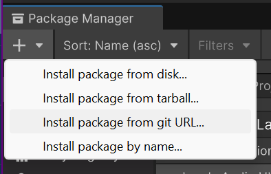

A unity package containing a single script that lets you use the various easing functions written by [Robert Penner](https://robertpenner.com/easing/).
C# implementation written by [C.J. Kimberlin](http://cjkimberlin.com).

The main purpose of this library is procedural animation. For example showing and hiding UI elements, or animating a cash value indicator.

## Installation

In Unity, click "Install package from git URL..." and paste in ``https://github.com/Landeplage/com.landeaudio.easing.git``.



## Usage

Serialize the easing type so you can choose an ease type in the inspector. Cache the function you need and call it like the example below.

```csharp
using UnityEngine;

public class EaseExample : MonoBehaviour
{
    [SerializeField] EasingFunction.Ease easeType;
    
    EasingFunction.Function easeFunc;
    float t;

    void Awake() {
        easeFunc = EasingFunction.GetEasingFunction(easeType);
    }

    void Update() {
        if (t < 1f) {
            t += Time.deltaTime;

            if (t > 1f)
                t -= 1f;
        }

        float easedT = easeFunc(0f, 1f, t);
        Debug.Log(easedT);
    }
}
```

